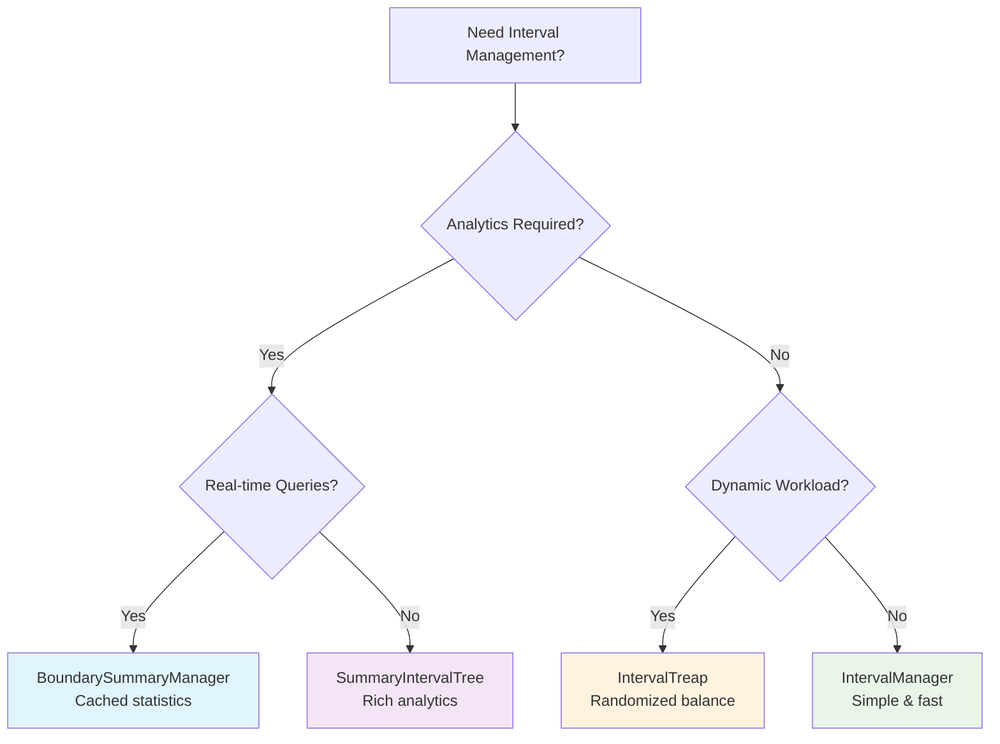

# 🌳 Tree-Mendous: Interval Tree Visualizations & Architecture

## Overview

Tree-Mendous provides multiple interval tree implementations, each optimized for different use cases. This document visualizes how these data structures work and when to use each one.

## 📊 Core Concept: Interval Management

All our implementations solve the **interval allocation problem**:

```
Available Space: [0════════════════════1000)

After reserving [200, 400):
Available: [0═══════200)     [400═══════1000)
Reserved:           [200═══400)
```

## 🏗️ Implementation Architecture

### 1. **Basic Boundary Manager** (`IntervalManager`)
*Simple, efficient boundary-based tracking*

```python
from treemendous.basic.boundary import IntervalManager

manager = IntervalManager()
manager.release_interval(0, 1000)    # Mark as available
manager.reserve_interval(300, 500)   # Allocate space

# Find 100 units starting at position 100
result = manager.find_interval(100, 100)
# → IntervalResult(start=100, end=200, length=100)
```

**Visualization:**
```
Memory Layout:
├─ Available: [0────────300)
├─ Reserved:           [300──500)  
└─ Available:                [500────1000)

Data Structure: SortedDict
{0: 300, 500: 1000}
```

**Best For:** Fast insertions, simple allocation patterns

---

### 2. **Summary-Enhanced Trees** (`SummaryIntervalTree`)
*Aggregate statistics for optimization*

```python
from treemendous.basic.summary import SummaryIntervalTree

tree = SummaryIntervalTree()
tree.release_interval(0, 1000)
tree.reserve_interval(200, 400)

# Get comprehensive statistics
summary = tree.get_tree_summary()
print(f"Fragmentation: {summary.fragmentation_index:.2f}")
print(f"Largest gap: {summary.largest_free_length}")
```

**Visualization:**
```
Tree Structure (Each node tracks summaries):

         [500────1000)
         stats: {free: 500, largest: 500}
        /                    \
   [0──200)              [600──800)
   stats: {free: 200}    stats: {free: 200}

Aggregate Summary:
├─ Total Free: 700 units
├─ Largest Chunk: 500 units  
├─ Fragmentation: 0.29
└─ Utilization: 0.30
```

**Best For:** Resource management with analytics, defragmentation

---

### 3. **Randomized Treaps** (`IntervalTreap`)
*Probabilistically balanced trees*

```python
from treemendous.basic.treap import IntervalTreap

treap = IntervalTreap(random_seed=42)
treap.release_interval(0, 1000)

# Probabilistic operations
sample = treap.sample_random_interval()
left, right = treap.split(500)  # Split at position 500
```

**Visualization:**
```
Treap Structure (BST + Heap by priority):

    [300──600) p=0.85
   /                \
[100─200)      [700──900) p=0.72
p=0.90        /         \
         [650─680)   [920─950)
         p=0.61      p=0.58

Properties:
✓ BST: Left intervals < Root < Right intervals  
✓ Heap: Parent priority ≥ Child priorities
✓ Expected O(log n) height due to randomization
```

**Best For:** Dynamic workloads, randomized allocation, load balancing

---

### 4. **Boundary Summary Manager** (`BoundarySummaryManager`)
*High-performance with caching*

```python
from treemendous.basic.boundary_summary import BoundarySummaryManager

manager = BoundarySummaryManager()
manager.release_interval(0, 10000)

# Smart allocation strategies
best_fit = manager.find_best_fit(500)        # Minimize waste
largest = manager.find_largest_available()   # Maximum capacity

# Performance insights
perf = manager.get_performance_stats()
print(f"Cache hit rate: {perf.cache_hit_rate:.1%}")
```

**Visualization:**
```
Cached Summary Architecture:

┌─────────────────────────────────────┐
│           Interval Storage          │
│  {0: 2000, 3000: 5000, 7000: 10000} │
└─────────────────────────────────────┘
                    │
                    ▼
┌─────────────────────────────────────┐
│          Cached Summary             │
│  • total_free: 7000                │
│  • largest_chunk: 3000             │  
│  • fragmentation: 0.57             │
│  • cache_hits: 147                 │
└─────────────────────────────────────┘

Query Performance:
├─ find_best_fit(): O(n) with early exit
├─ get_summary(): O(1) when cached
└─ Cache invalidation on modifications
```

**Best For:** High-frequency queries, performance monitoring

---

## 🎯 Use Case Matrix

| Implementation | Memory Overhead | Query Speed | Insert Speed | Best Use Case |
|----------------|----------------|-------------|--------------|---------------|
| **Boundary** | Low | O(log n) | O(log n) | Simple allocation |
| **Summary** | Medium | O(log n) | O(log n) | Analytics needed |
| **Treap** | Medium | O(log n) | O(log n) | Dynamic/random load |
| **BoundarySummary** | Low | O(1)-O(n) | O(log n) | High query frequency |

## 🔄 Real-World Scenarios

### Scenario 1: Cloud Resource Scheduling
```python
# Managing CPU cores across time
scheduler = SummaryIntervalTree()
scheduler.release_interval(0, 24*3600)  # 24 hours available

# Schedule jobs
scheduler.reserve_interval(3600, 7200)    # Job 1: 1-2 AM
scheduler.reserve_interval(14400, 18000)  # Job 2: 4-5 AM

# Find optimal placement for 2-hour job
slot = scheduler.find_best_fit(7200)  # 2 hours
if slot:
    print(f"Schedule job at {slot.start//3600}:00")
```

### Scenario 2: Memory Pool Management
```python
# Managing memory segments
memory = IntervalTreap(random_seed=time.time())
memory.release_interval(0, 1024*1024)  # 1MB pool

# Allocate buffers of various sizes
for size in [4096, 8192, 2048]:
    allocation = memory.find_interval(0, size)
    if allocation:
        memory.reserve_interval(allocation.start, allocation.end)
```

### Scenario 3: Manufacturing Line Optimization
```python
# Production line scheduling
line = BoundarySummaryManager()
line.release_interval(0, 480)  # 8-hour shift (minutes)

# Schedule production runs
line.reserve_interval(60, 120)   # Product A: 60 min
line.reserve_interval(180, 240)  # Product B: 60 min

# Analytics for optimization
stats = line.get_availability_stats()
print(f"Line utilization: {stats['utilization']:.1%}")
print(f"Largest available slot: {stats['largest_chunk']} minutes")
```

## 🔍 Visual Algorithm Walkthrough

### AVL Tree Operations

```
Initial: Empty tree
├─ release_interval(100, 200)

Tree: [100──200)

├─ release_interval(300, 400)

Tree:     [100──200)
               \
              [300──400)

├─ release_interval(50, 150)  # Overlaps with [100,200)

Tree:     [50───200)     # Merged
               \
              [300──400)

├─ reserve_interval(75, 125)  # Split interval

Tree:     [50─75)           [125─200)
               \                /
              [300──400)

Final intervals: [50,75), [125,200), [300,400)
```

### Treap Probabilistic Balancing

```
Insert sequence with priorities:

[100,200) p=0.95
↓
[100,200) p=0.95
/
[50,150) p=0.30

↓ (rotate right due to heap property violation)

    [50,150) p=0.30
           \
          [150,200) p=0.95

Properties maintained:
✓ BST order: 50 < 100 < 150 < 200
✓ Heap priorities: 0.95 > 0.30
✓ Probabilistic balance: E[height] = O(log n)
```

## 📈 Performance Characteristics

### Operation Complexity Comparison

```
┌─────────────────┬─────────┬─────────┬─────────┬─────────┐
│ Operation       │ Boundary│ Summary │ Treap   │ Boundary│
│                 │         │         │         │ Summary │
├─────────────────┼─────────┼─────────┼─────────┼─────────┤
│ release_interval│ O(log n)│ O(log n)│ O(log n)│ O(log n)│
│ reserve_interval│ O(log n)│ O(log n)│ O(log n)│ O(log n)│
│ find_interval   │ O(log n)│ O(log n)│ O(log n)│ O(log n)│
│ get_summary     │   N/A   │ O(log n)│   N/A   │  O(1)*  │
│ find_best_fit   │   N/A   │ O(log n)│   N/A   │  O(n)   │
│ random_sample   │   N/A   │   N/A   │ O(log n)│   N/A   │
└─────────────────┴─────────┴─────────┴─────────┴─────────┘
                                              * When cached
```

### Memory Usage Patterns

```
Memory per Node:
├─ Boundary: ~32 bytes (just boundaries)
├─ Summary: ~80 bytes (+ aggregate stats)  
├─ Treap: ~48 bytes (+ priority + size)
└─ BoundarySummary: ~32 bytes + cache overhead
```

## 🛠️ Implementation Selection Guide

### When to Use Each Implementation



### Decision Framework

1. **Start Simple**: `IntervalManager` for basic needs
2. **Add Analytics**: `SummaryIntervalTree` when you need insights
3. **Go Random**: `IntervalTreap` for unpredictable workloads
4. **Optimize Hot Path**: `BoundarySummaryManager` for query-heavy scenarios

## 🔬 Advanced Features

### Multi-Implementation Benchmarking

```python
from treemendous.backend_manager import BackendManager

# Compare all implementations
manager = BackendManager()
results = {}

for backend in ['py_boundary', 'py_treap', 'cpp_boundary']:
    manager.switch_backend(backend)
    
    # Run identical workload
    start_time = time.time()
    for i in range(1000):
        manager.release_interval(i*10, i*10 + 5)
    
    results[backend] = time.time() - start_time

print("Performance comparison:", results)
```

### Cross-Implementation Validation

```python
# Verify equivalent behavior across implementations
implementations = [
    IntervalManager(),
    SummaryIntervalTree(), 
    IntervalTreap(random_seed=42),
    BoundarySummaryManager()
]

operations = [(0, 1000), (200, 400), (600, 800)]

for impl in implementations:
    for start, end in operations:
        impl.release_interval(start, end)
    
    # All should report same total
    total = impl.get_total_available_length()
    print(f"{impl.__class__.__name__}: {total} units")
```

## 🎨 Visualization Tools

### Tree Structure Printer

```python
def visualize_tree_structure():
    tree = SummaryIntervalTree()
    
    # Build example tree
    intervals = [(100, 200), (300, 450), (600, 800), (900, 950)]
    for start, end in intervals:
        tree.release_interval(start, end)
    
    # Print tree structure
    tree.print_tree()
    
    """
    Output:
    [600──800) (free=200, largest=200)
    ├─ [300──450) (free=150, largest=150)
    │  └─ [100──200) (free=100, largest=100)
    └─ [900──950) (free=50, largest=50)
    """
```

### Fragmentation Visualization

```python
def show_fragmentation_analysis():
    manager = BoundarySummaryManager()
    manager.release_interval(0, 1000)
    
    # Create fragmentation
    for i in range(0, 1000, 100):
        if i % 200 == 0:  # Reserve every other block
            manager.reserve_interval(i, i + 50)
    
    summary = manager.get_summary()
    
    print("Fragmentation Analysis:")
    print("█" * 50)
    print("Available:")
    
    for interval in manager.get_intervals():
        start_pos = int(interval.start / 1000 * 50)
        length = int(interval.length / 1000 * 50)
        print(" " * start_pos + "█" * length)
    
    print(f"Fragmentation Index: {summary.fragmentation_index:.2f}")
```

## 🚀 Performance Optimization Patterns

### Pattern 1: Summary-Driven Allocation

```python
# Use summary statistics to make smart decisions
def smart_allocator(tree: SummaryIntervalTree, size: int):
    summary = tree.get_tree_summary()
    
    if summary.largest_free_length < size:
        return None  # Quick elimination
    
    if summary.fragmentation_index > 0.7:
        # High fragmentation - try best fit
        return tree.find_best_fit(size)
    else:
        # Low fragmentation - any fit works
        return tree.find_interval(0, size)
```

### Pattern 2: Adaptive Backend Selection

```python
def adaptive_manager(workload_characteristics):
    if workload_characteristics['query_heavy']:
        return BoundarySummaryManager()  # Cached queries
    elif workload_characteristics['dynamic']:
        return IntervalTreap()  # Self-balancing
    elif workload_characteristics['analytics']:
        return SummaryIntervalTree()  # Rich statistics
    else:
        return IntervalManager()  # Simple and fast
```

## 📋 Comparison Matrix

### Feature Support

```
┌─────────────────────┬─────────┬─────────┬─────────┬─────────┐
│ Feature             │Boundary │ Summary │ Treap   │Boundary │
│                     │         │         │         │Summary  │
├─────────────────────┼─────────┼─────────┼─────────┼─────────┤
│ Basic Operations    │    ✓    │    ✓    │    ✓    │    ✓    │
│ Summary Statistics  │    ✗    │    ✓    │    ✗    │    ✓    │
│ Best Fit Allocation │    ✗    │    ✓    │    ✗    │    ✓    │
│ Random Sampling     │    ✗    │    ✗    │    ✓    │    ✗    │
│ Split/Merge Ops     │    ✗    │    ✗    │    ✓    │    ✗    │
│ Performance Cache   │    ✗    │    ✗    │    ✗    │    ✓    │
│ C++ Implementation  │    ✓    │    ✓    │    ✓    │    ✓    │
└─────────────────────┴─────────┴─────────┴─────────┴─────────┘
```

## 🎯 Application Examples

### 1. **Real-Time Systems** - Deadline Scheduling

```python
"""CPU scheduling with deadline constraints"""
scheduler = SummaryIntervalTree()
scheduler.release_interval(0, 1000)  # 1000ms scheduling window

# Schedule high-priority task
urgent_task = scheduler.find_interval(0, 100)  # Must start early
scheduler.reserve_interval(urgent_task.start, urgent_task.end)

# Check remaining capacity
remaining = scheduler.get_tree_summary()
print(f"Remaining CPU: {remaining.total_free_length}ms")
```

### 2. **Network Bandwidth Allocation**

```python
"""Dynamic bandwidth allocation with QoS"""
bandwidth = IntervalTreap()
bandwidth.release_interval(0, 1000)  # 1 Gbps available

# Allocate with randomization for fairness
for user_id in range(10):
    allocation = bandwidth.find_interval(0, 50)  # 50 Mbps
    if allocation:
        bandwidth.reserve_interval(allocation.start, allocation.end)
        print(f"User {user_id}: {allocation.start}-{allocation.end} Mbps")
```

### 3. **Memory Pool Management**

```python
"""Heap management with fragmentation monitoring"""
heap = BoundarySummaryManager()
heap.release_interval(0, 2**20)  # 1MB heap

def allocate_with_monitoring(size):
    # Check fragmentation before allocation
    stats = heap.get_availability_stats()
    
    if stats['fragmentation'] > 0.8:
        print("⚠️ High fragmentation detected")
        # Trigger compaction logic
    
    return heap.find_best_fit(size)
```

## 🔬 Mathematical Analysis

### Expected Tree Heights

```
Implementation    | Average Height | Worst Case
─────────────────┼───────────────┼────────────
AVL Trees        | 1.44 log₂(n)  | 1.44 log₂(n)
Treaps           | ~3 ln(n)      | O(n) (rare)
Summary Trees    | 1.44 log₂(n)  | 1.44 log₂(n)
```

### Space Complexity

```
Data Structure   | Space per Node | Total Overhead
─────────────────┼───────────────┼────────────────
Boundary Map     | 16 bytes      | O(n)
Summary Node     | 64 bytes      | O(n)  
Treap Node       | 32 bytes      | O(n)
Cached Summary   | 16 bytes + O(1) cache
```

## 🎯 Best Practices

### 1. **Choose the Right Tool**
```python
# Quick decision tree
def select_implementation(requirements):
    if requirements.get('analytics'):
        return SummaryIntervalTree()
    elif requirements.get('high_query_frequency'):
        return BoundarySummaryManager()
    elif requirements.get('dynamic_balance'):
        return IntervalTreap()
    else:
        return IntervalManager()  # Default choice
```

### 2. **Monitor Performance**
```python
# Always profile your specific workload
def benchmark_implementations(operations):
    implementations = [IntervalManager(), IntervalTreap(), BoundarySummaryManager()]
    
    for impl in implementations:
        start = time.perf_counter()
        
        for op, start_pos, end_pos in operations:
            if op == 'release':
                impl.release_interval(start_pos, end_pos)
            else:
                impl.reserve_interval(start_pos, end_pos)
        
        duration = time.perf_counter() - start
        print(f"{impl.__class__.__name__}: {duration:.4f}s")
```

### 3. **Handle Protocol Conformance**
```python
# All implementations now return standardized results
def universal_allocation(manager, size):
    result = manager.find_interval(0, size)
    
    # Always returns IntervalResult or None
    if result:
        print(f"Allocated: [{result.start}, {result.end})")
        return result
    else:
        print("Allocation failed")
        return None
```

---

*Built with mathematical rigor and operational excellence* 🎯
